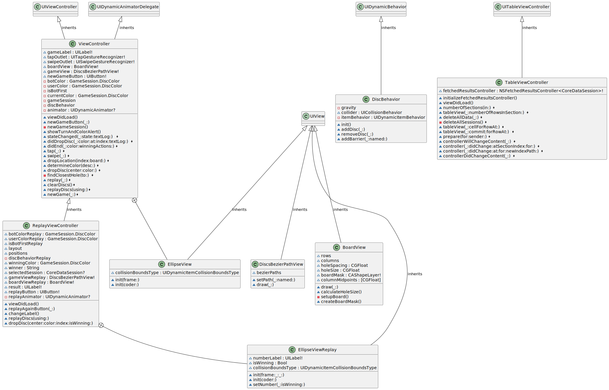

# Connect4 iOS App

## Overview

This repository contains the source code for a Connect4 iOS app developed as an individual assignment for the COMP47390 course on Swift Programming for App Development. The app implements the classic Connect4 game with dynamic animations, Core Data integration for session tracking, and replay functionality.

## UML Diagram

The project includes a UML diagram outlining the class hierarchy and relationships between key components such as `UIViewController`, `UIDynamicAnimatorDelegate`, `UIDynamicBehavior`, `UITableViewController`, `BoardView`, `DiscBehavior`, and more.

## Components

### BoardView

- Custom `UIView` representing the game board.
- Features 6 rows and 7 columns with dynamic hole sizing.
- Utilizes `CAShapeLayer` as a mask to create holes on the board.
- Interaction handling for potential user interactions.

### DiscBehavior

- Manages the animation and physics of discs in the Connect4 game.
- Uses `UIGravityBehavior` for simulating gravity.
- Utilizes `UICollisionBehavior` for handling collisions.
- Manages individual disc properties using `UIDynamicItemBehavior`.
- Provides methods for adding and removing discs and adding barriers.

### ViewController

- Main view controller for the Connect4 game.
- Manages UI components such as `gameLabel`, `tapOutlet`, `swipeOutlet`, `boardView`, `gameView`, and `newGameButton`.
- Implements game session logic through `GameSession`.
- Uses `UIDynamicAnimator` for dynamic disc behavior.
- Handles user interactions, button actions, and game state changes.

### TableViewController

- Displays a table view of game sessions stored in Core Data.
- Utilizes `NSFetchedResultsController` for managing Core Data fetch requests.
- Implements table view data source and delegate methods.
- Handles deletion of game sessions and prepares for segues to `ReplayViewController`.

### ReplayViewController

- Extends functionality of `ViewController` for replaying game sessions.
- Displays the game view, board view, and result label during replay.
- Uses `UIDynamicAnimator` for managing dynamic behaviors during replay.
- Implements custom animations for disc replay.
- Allows users to replay the session and view the result.

## How to Run

To run the Connect4 app, follow these steps:

1. Clone the repository.
2. Open the project in Xcode.
3. Build and run the app on a simulator or a physical iOS device.

## Acknowledgments

This project incorporates various Swift programming concepts, UIKit, Core Data, and dynamic animations. It serves as a practical demonstration of iOS app development skills.

Feel free to explore the codebase, experiment with the app, and provide feedback!
